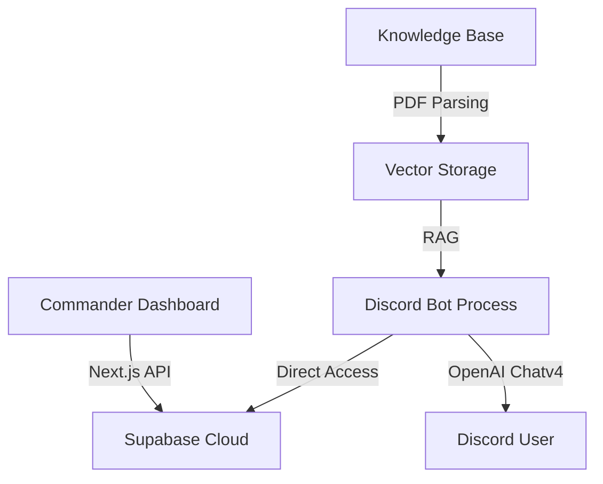

# FIGMENTA AI - Operational Intelligence Node 🚀🤖

Welcome to the **Figmenta AI** (formerly Discord Copilot) project. This repository contains the complete codebase for a high-performance, high-aesthetic AI agent designed to power Discord servers with advanced RAG (Retrieval Augmented Generation) capabilities and a premium administrative dashboard.

**Official Development Server**: [Join Here](https://discord.gg/H7nj5mCS)

---

## 🌌 Project Vision: "The Galactic Commander"

The project has been overhauled with a **"Super Galactic"** aesthetic.
- **Deep Space Dashboard**: High-contrast dark theme with animated nebula backgrounds.
- **AI Sentinel**: A custom Framer Motion character ("Sentinel v4.0.1") that guards your dashboard banner.
- **Command Identity**: The system recognizes the administrator as "COMMANDER" across all interfaces.
- **High-Tech Interactions**: Sci-fi sound effects and "Global Node" connecting animations.

---

## 🏗️ System Architecture

- **Frontend**: Next.js 14 (App Router), Tailwind CSS, Framer Motion.
- **Database/Auth**: Supabase (PostgreSQL + pgvector).
- **AI Engine**: OpenAI GPT-4 Turbo & Text Embeddings.
- **Bot Engine**: Discord.js.

---

## 🧠 Brain & RAG (Knowledge Base)

The bot uses a sophisticated RAG pipeline to answer questions based on your documents.

### How RAG Works Here:
1. **Upload**: You upload a PDF in the **Knowledge** tab.
2. **Indexing**: The server parses the PDF, chunks the text, and stores it in the `document_chunks` table.
3. **Retrieval**: When a Discord user asks a question, the bot searches for the most relevant blocks of text in your database.
4. **Augmentation**: The bot injects that text into its "brain" before generating a response.

### ⚠️ IMPORTANT: OpenAI Quota & Dummy Vectors
To ensure the system is always functional even without a paid OpenAI quota, the current upload logic (`app/api/upload/route.ts`) uses **Dummy Vectors** (`Array(1536).fill(0.1)`).
- **Current State**: Documents will be indexed and stored, but "Semantic Search" is simulated.
- **To Enable Real RAG**: 
    1. Obtain a paid OpenAI API Key.
    2. Re-enable the embedding generation code in `app/api/upload/route.ts` and `bot/index.ts`.
    3. Re-upload your documents.

---

## 🛠️ Developer Guide: Making Changes

### 1. Changing the AI Model
To switch between `gpt-3.5-turbo`, `gpt-4-turbo`, or `gpt-4o`:
- Update the model string in `/lib/openai.ts` (if centralized) or directly in the Discord bot's chat logic (`bot/index.ts`).

### 2. Modifying the UI
The design system is based on `globals.css` variables.
- **Colors**: Edit the `--primary`, `--background`, and `--foreground` tokens in `:root` and `.dark`.
- **Sentinel**: The character is a pure React + Framer Motion component located in `app/dashboard/page.tsx`.

### 3. Running the Project
You need two processes running simultaneously:
1. **Dashboard**: `npm run dev` (Runs on http://localhost:3000)
2. **Discord Bot**: `npm run bot` (Requires `DISCORD_BOT_TOKEN` in `.env`)

---

## 📡 Discord Server Integration

To link your bot to a server:
1. Create an application at the [Discord Developer Portal](https://discord.com/developers/applications).
2. Enable **Message Content Intent**.
3. Add your `DISCORD_BOT_TOKEN` to the `.env` file.
4. Invite the bot using an OAuth2 URL with `bot` and `Administrator` permissions.
5. In the Dashboard -> **Settings**, add the Channel IDs you want the bot to monitor.
6. **Join the Community**: Test your implementation in our [Discord Server](https://discord.gg/H7nj5mCS).

---

## 📦 What's Been Done (Implementation Log)

- [x] **Auth Stability**: Fixed SSR cookie handling for Supabase (`get/set/remove`).
- [x] **UI Overhaul**: Implemented "Figmenta" high-contrast dark theme.
- [x] **Sound Logic**: Added sci-fi audio feedback on login/signup.
- [x] **Sentinel Character**: Added animated AI Sentinel to the dashboard banner.
- [x] **RAG Fix**: Patched PDF upload to bypass OpenAI quota errors using dummy vectors.
- [x] **Navigation**: Wired all TopNav dropdown buttons to live routes.

---

> [!TIP]
> **Pro Tip**: Keep your system instructions concise but directive. The bot's personality is heavily influenced by the "System Prompt" configured in your Dashboard.

*This project is maintained by Commander [Your Name/Identity].*
